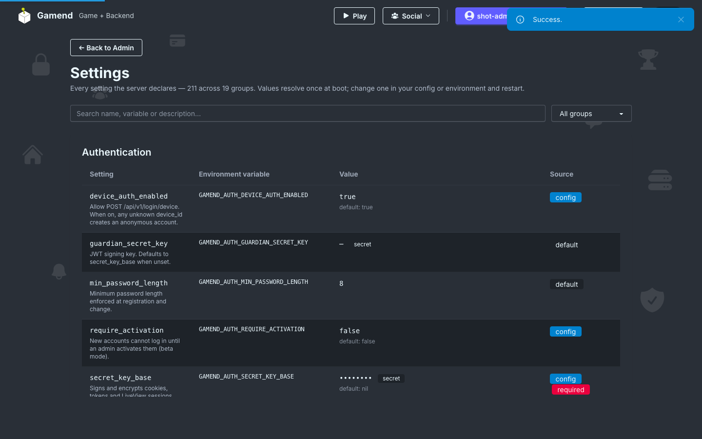
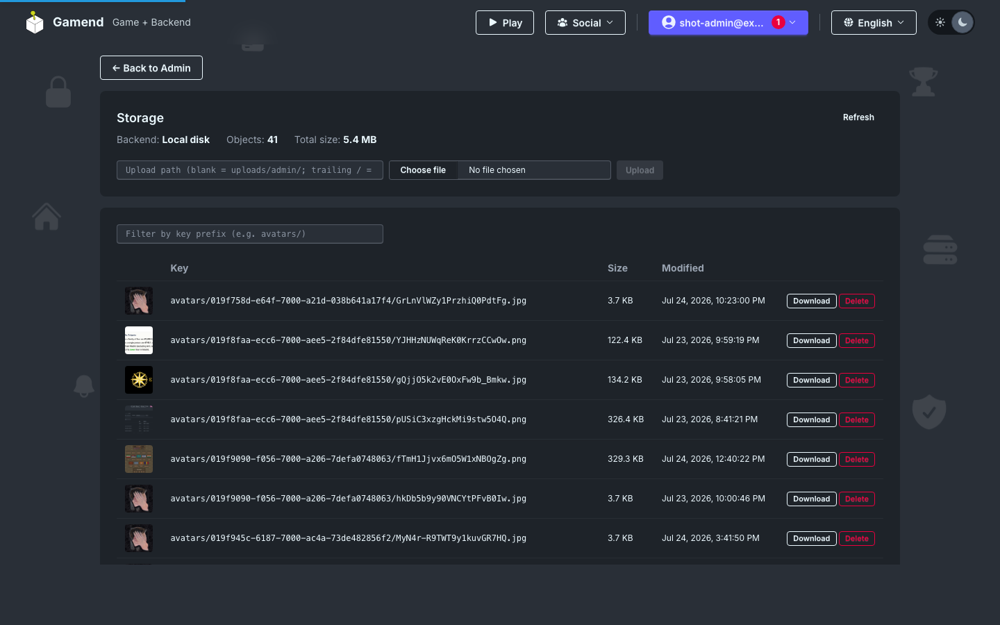
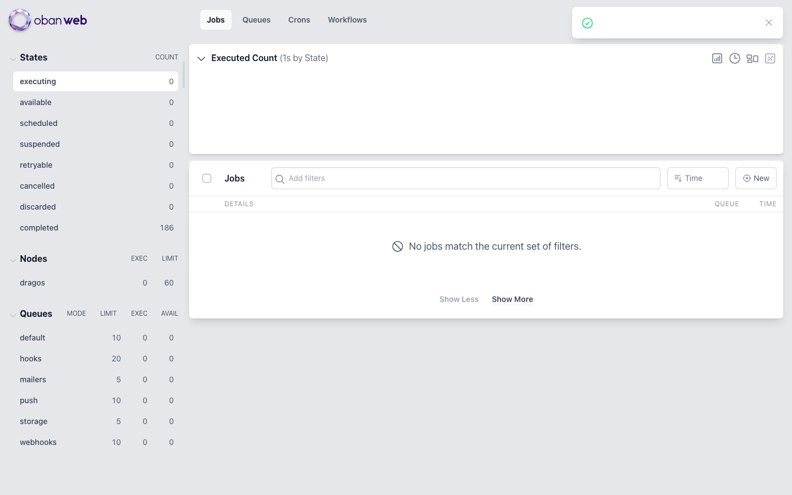

# Ops: Settings, Storage, Jobs, Retention

Added one library settings where every env var name is derived from code. Added object storage that uses both local disk and S3/R2 API. Updated the background jobs to use Oban, and retention for every unbounded table.

## Settings

Every setting the server understands is now *declared* in code.

```elixir
setting :min_password_length, :integer,
  default: 8,
  doc: "Minimum password length."
```

Settings are `required`, `warn` or `optional`.



## Object storage

Avatars and icons go through one storage facade with two backends: `local disk` and any `S3-compatible` service. Everything is inspectable in admin:



## Jobs and retention

Background work — push fan-out, mailers, webhooks, pruning — runs on Oban, with the full dashboard mounted at `/admin/oban`:



- [Settings reference](https://gamend.appsinacup.com/docs/setup)
- [Github](https://github.com/appsinacup/game_server)
