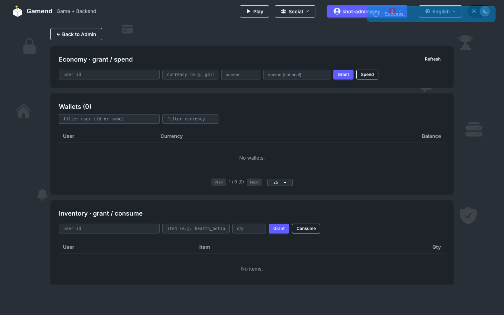

# Economy: Wallets, Ledger, Inventory

Virtual currencies with an append-only ledger, an item inventory, and payment providers (Stripe, Google Play, App Store, Steam) that grant entitlements server-side.

## Wallets and the ledger

A user has one wallet per currency, and every movement is a ledger row with a reason.

```elixir
Economy.grant(user_id, "gold", 100, reason: "match_reward")

case Economy.spend(user_id, "gold", 30, reason: "store_purchase") do
  {:ok, wallet} -> deliver_item(user_id)
  {:error, :insufficient_funds} -> :nope
end
```



- [Github](https://github.com/appsinacup/game_server)
