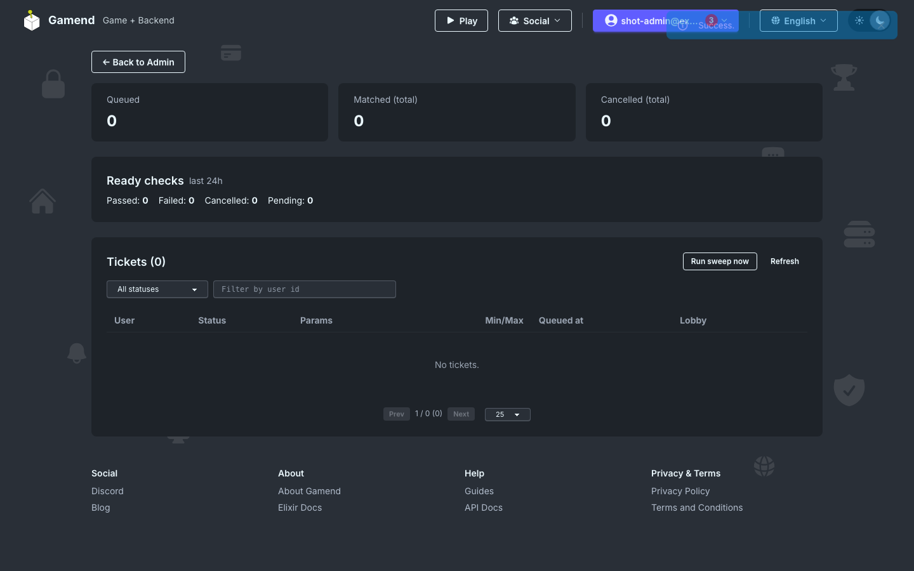
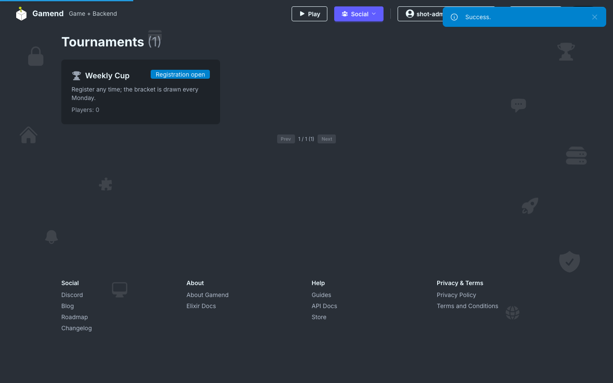

# Matchmaking, Tournaments and Ready Checks

We added support for the following:

- Matchmaking: a ticket-queue matchmaker with support for parties that creates a lobby when a match is found.
- Tournaments: recurring bracket tournaments that run themselves, with a register and bracket form phase.
- Lobby and Party Ready Check.

## Matchmaking

Players (or parties) create a ticket into the matchmaking queue. A periodic sweep forms matches. The admin page shows queues and tickets:

## Tournaments

Bracket tournaments are defined once and repeat. Similarly to leaderboards. Registration windows, bracket size, team size and deadline policy are all per-tournament.

Stages:
- Registration phase
- Draw phase
- Round phase

- [Github](https://github.com/appsinacup/game_server)
