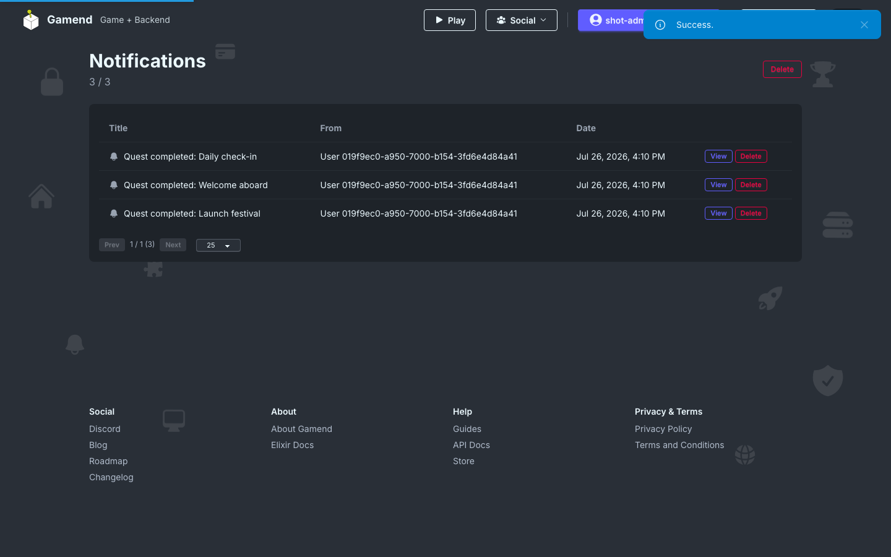

# Push Notifications

Server-side push notifications with device token storage.

## Device tokens

Clients register their token. Then server sends a push notification to the job queue, so a burst of notifications never blocks a request.



```elixir
Notifications.admin_create_notification(user.id, user.id, %{
  "title" => "Welcome!",
  "content" => "Thanks for joining.",
  "icon_url" => "/icons/bell.svg"
})
```

- [Github](https://github.com/appsinacup/game_server)
