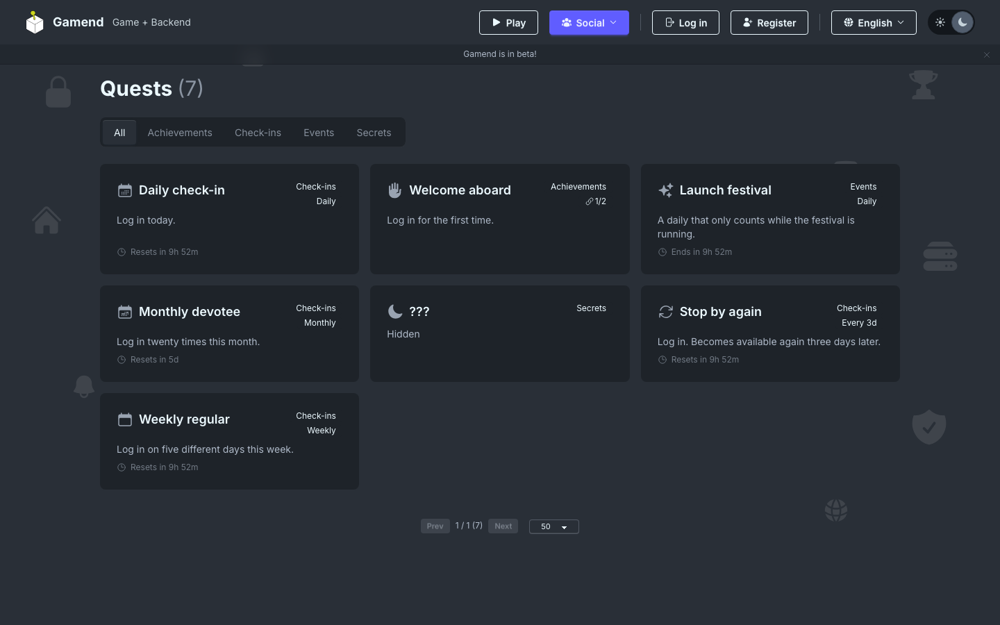

# Quests: One Progression System

Gamend now has a full quest system — dailies, weeklies, chains, secret quests and time-limited events — replacing the old achievements.



## Categories and cadence

A quest has a category ("Check-ins", "Events", etc.) and separately has a reset cadence: daily, weekly, monthly, every N days, or never.

## Chains, secrets and windows

A chained quest stays locked until its prerequisite completes.

Hidden quests appear as "???" until earned.

Event quests only run inside their start/end window.

## Defining quests from a plugin

Quests are created from code at startup:

```elixir
Quests.create_quest(%{
  key: "weekly_regular",
  title: "Weekly regular",
  description: "Log in on five different days this week.",
  category: "Check-ins",
  reset: "weekly",
  icon_url: "/icons/calendar.svg",
  objectives: [%{event: "login", target: 5}]
})
```

Game code would then do: `Quests.report_event(user_id, "login")`

- [Github](https://github.com/appsinacup/game_server)
